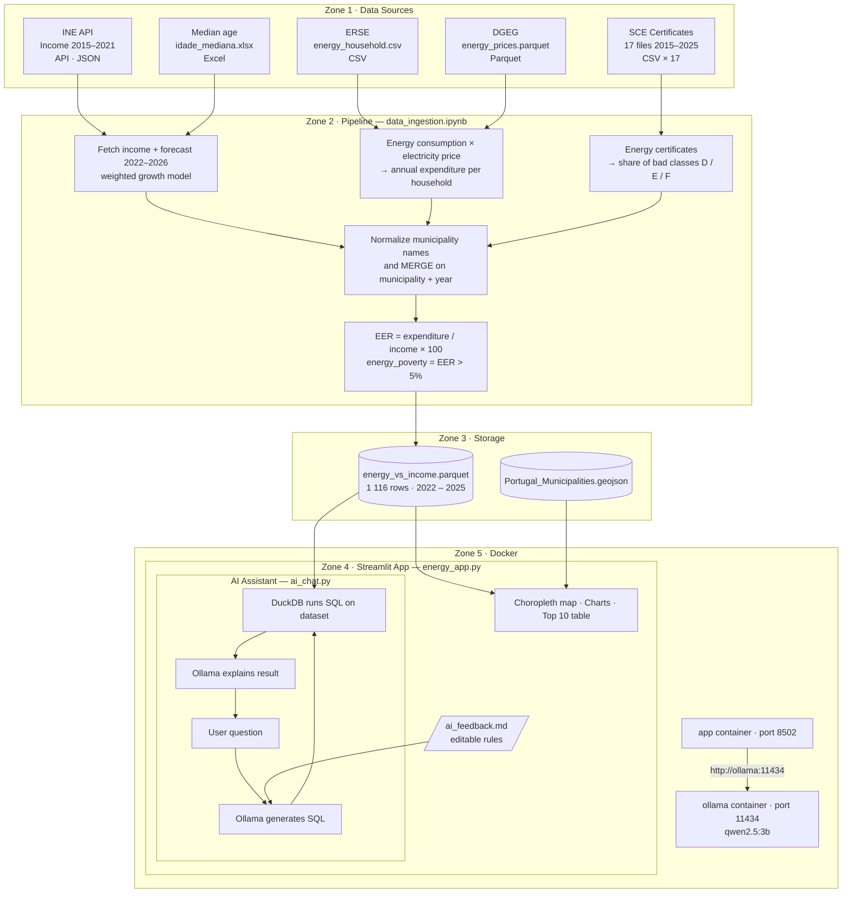

# Architecture — Energy Poverty Explorer

```mermaid
flowchart TD

    subgraph SRC["Zone 1 · Data Sources"]
        A1["INE API\nIncome 2015–2021\nAPI · JSON"]
        A2["ERSE\nenergy_household.csv\nCSV"]
        A3["DGEG\nenergy_prices.parquet\nParquet"]
        A4["SCE Certificates\n17 files 2015–2025\nCSV × 17"]
        A5["Median age\nidade_mediana.xlsx\nExcel"]
    end

    subgraph PIPE["Zone 2 · Pipeline  —  data_ingestion.ipynb"]
        B1["Fetch income + forecast 2022–2026\nweighted growth model"]
        B2["Energy consumption × electricity price\n→ annual expenditure per household"]
        B3["Energy certificates\n→ share of bad classes D / E / F"]
        B4["Normalize municipality names\nand MERGE on municipality + year"]
        B5["EER = expenditure / income × 100\nenergy_poverty = EER > 5%"]
    end

    subgraph STORE["Zone 3 · Storage"]
        C1[("energy_vs_income.parquet\n1 116 rows · 2022 – 2025")]
        C2[("Portugal_Municipalities.geojson")]
    end

    subgraph DOCKER["Zone 5 · Docker"]
        subgraph APP["Zone 4 · Streamlit App  —  energy_app.py"]
            D1["Choropleth map · Charts · Top 10 table"]
            subgraph AI["AI Assistant  —  ai_chat.py"]
                E1["User question"]
                E2["Ollama generates SQL"]
                E3["DuckDB runs SQL on dataset"]
                E4["Ollama explains result"]
            end
            E5[/"ai_feedback.md\neditable rules"/]
        end
        F1["app container · port 8502"]
        F2["ollama container · port 11434\nqwen2.5:3b"]
    end

    A1 & A5 --> B1
    A2 & A3 --> B2
    A4 --> B3
    B1 & B2 & B3 --> B4 --> B5 --> C1

    C1 --> D1
    C2 --> D1
    C1 --> E3

    E1 --> E2 --> E3 --> E4 --> E1
    E5 --> E2

    F1 -- "http://ollama:11434" --> F2
```
