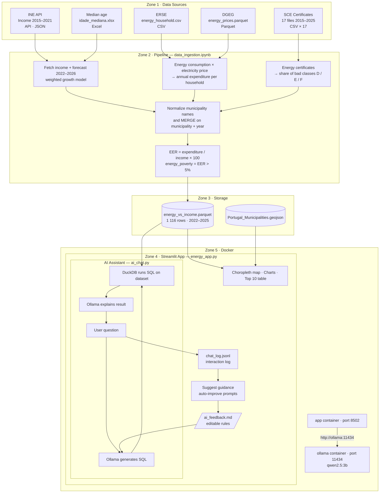

# Energy Poverty Explorer — Portugal

Interactive web app to explore energy poverty indicators across Portuguese
municipalities, built with Streamlit and Plotly. It also has a small AI
assistant on the side that answers questions about the data, powered by a
local Ollama model.

---

## Architecture



---

## What you need

Just **Docker** (with Docker Compose, which comes with Docker Desktop).

You don't need to install Python, Streamlit or Ollama yourself — everything
runs inside containers. There are two of them:

- **app** — the Streamlit app
- **ollama** — runs the local AI model the assistant talks to

---

## How to run

From the project folder:

```bash
docker compose up -d
```

The first time, you also need to pull a model into the Ollama container so the
AI assistant has something to think with:

```bash
docker compose exec ollama ollama pull qwen2.5:3b
```

Then open **http://localhost:8502** in your browser.

When you're done:

```bash
docker compose down
```

---

## The AI assistant

On the left sidebar there's an "Ask AI" panel. You type a question in plain
language (Portuguese or English) and it answers using only the data in this
project — not the internet, not general knowledge.

How it works under the hood:

1. Your question goes to a **local Ollama model** (nothing leaves your machine).
2. The model turns the question into a **SQL query** over the dataset.
3. The query runs with DuckDB against the real data.
4. The model reads the result and writes a normal-language answer.

If you ask something that isn't about the data (like "what's the capital of
Portugal?"), it just politely says it can only answer questions about this
dataset.

You can pick which model to use in the sidebar. **qwen2.5:3b** works best and is
nice and fast; `qwen2.5-coder:7b` and `llama3.2:3b` also work if you pull them.

### Teaching it / fixing answers

All the AI behaviour lives in `ai_chat.py`, and the examples that guide it are in
`ai_feedback.md`. That feedback file is plain text — if the model keeps getting
something wrong (picking the wrong column, misreading "pior" vs "melhor", etc.),
just edit `ai_feedback.md` and add an example. It's re-read on every question, so
the change takes effect right away, no rebuild needed. Only someone with access
to the file can change it, so app users can't mess with the rules.

### Auto-improve guidance (NEW!)

Every chat interaction is logged to `chat_log.jsonl` — this captures questions,
SQL generated, and whether they succeeded or failed. Click the **"Suggest guidance"**
button (next to "Clear chat") to let the AI analyze the log and suggest new GOOD/BAD
examples to add to `ai_feedback.md`.

When you click "Suggest guidance":

1. The AI reads all recent chats from the log.
2. It suggests new Q→SQL pairs (GOOD examples) based on what it saw work.
3. It suggests new Q patterns to refuse (BAD examples) based on failures/out-of-scope questions.
4. You get an editable text area where you can tweak the suggestions.
5. **View Database** button lets you see the dataset while editing (for context).
6. Click "Append to ai_feedback.md" to accept the suggestions.

The new examples take effect on the very next question — no rebuild needed.

---

## Refreshing the data (optional)

The processed dataset (`Data_treatment/energy_vs_income.parquet`) is already in
the repo, so you normally don't need to touch this.

If you do want to rebuild it from scratch, open and run all cells in
`Data_treatment/data_ingestion.ipynb`. That notebook downloads and cleans the
raw data and writes the parquet file. (Running the notebook needs a local Python
with `pandas`, `numpy`, `pyarrow`, `requests` and `geopandas` installed — it's
separate from the Docker setup.)

---

## Project structure

```
energy-poverty/
├── energy_app.py                       # Streamlit app (main entry point)
├── ai_chat.py                          # AI assistant: question → SQL → answer
│                                       # + logging & guidance generation
├── ai_feedback.md                      # Examples that guide the AI (edit freely)
├── chat_log.jsonl                      # All chat interactions (auto-logged, gitignored)
├── Dockerfile                          # Builds the app container
├── docker-compose.yml                  # Runs the app + ollama containers
├── requirements.txt                    # Python deps (installed inside the image)
├── Data_treatment/
│   ├── data_ingestion.ipynb            # Data pipeline (optional, rebuilds parquet)
│   └── energy_vs_income.parquet        # Processed dataset
└── geojsons/
    └── Portugal_Municipalities.geojson # Municipality boundaries for the map
```
